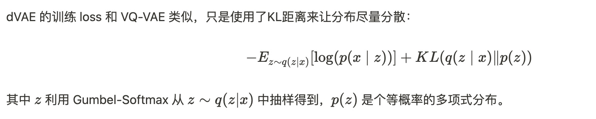

<div align="center">
  
  <div>&nbsp;</div>

[](https://discord.gg/drT8H85Y)
[](https://visitorbadge.io/status?path=https%3A%2F%2Fgithub.com%2Fbreezedeus%2FPix2Text-Mac)
[](./LICENSE)
[](https://github.com/breezedeus/Pix2Text-Mac)

[](https://twitter.com/breezedeus)

[👩🏻‍💻 Pix2Text Online Service](https://p2t.breezedeus.com) |
[👨🏻‍💻 Pix2Text Online Demo](https://huggingface.co/spaces/breezedeus/Pix2Text-Demo) |
[💬 Contact](https://www.breezedeus.com/join-group)

</div>

<div align="center">

[中文](./README_cn.md) | English

</div>


# Pix2Text-Mac: 识别数学公式的 Mac 桌面版应用
此项目是基于 [**Pix2Text**](https://github.com/breezedeus/Pix2Text) 实现的 Mac 本地 OCR 应用（无需联网），可以将剪贴板中的数学公式图片识别为其 LaTeX 表示，并将其复制到剪贴板；
同时也支持识别一般图片中的文本（文本 OCR）。

> 注意 ⚠️：该应用程序仅适用于 MacOS 。

本项目初始代码 Fork 自：[horennel/LaTex-OCR_for_macOS](https://github.com/horennel/LaTex-OCR_for_macOS)，感谢此项目作者。


## 功能

开启此应用后，可在 Mac 菜单栏看到 [Pix2Text](https://github.com/breezedeus/Pix2Text) 的应用图标，如下图。其中包含了 3 种模式的 OCR。

<div align="center">
  
</div>

### 1. `Mixed OCR`：识别既有公式又有文本的混合图片
可识别既包含数学公式又包含文本的混合图片，识别结果为 Markdown 格式，可把结果粘贴至 [Pix2Text 网页版](https://p2t.breezedeus.com) 查看渲染结果。

如可识别以下图片 ([assets/mixed.jpg](./assets/mixed.jpg))：

<div align="center">
  
</div>

### 2. `Formula OCR`：识别纯公式图片

可识别包含纯数学公式的图片，识别结果为 LaTeX 格式，可把结果粘贴至 [Pix2Text 网页版](https://p2t.breezedeus.com) 查看渲染结果。

如可识别以下图片 ([assets/math-formula-42.png](./assets/math-formula-42.png))：

<div align="center">
  
</div>

### 3. `Text OCR`：识别纯文本图片

可识别包含纯文本的图片，识别结果为纯文本。

如可识别以下图片 ([assets/text.jpg](./assets/text.jpg))：

<div align="center">
  
</div>


### 如何安装

- 克隆库

```bash
git clone https://github.com/breezedeus/Pix2Text-Mac
```

- 安装依赖环境

```bash
pip install -r requirements.txt
```

- 打包应用程序

```bash
python setup.py py2app -A
```

- 在生成的 `dist` 文件夹中可以看到应用程序`Pix2Text.app`，双击打开，或者将其移动到`应用程序文件夹`即可。

### 如何使用

- 启动程序
    - 启动应用`Pix2Text.app`，可以在菜单栏看到 Pix2Text 应用程序的图标；
    - 点击菜单栏图标的 `On / Off` 按钮，确保 `Mixed OCR`、`Formula OCR` 和 `Mixed OCR` 按钮常亮。
- 截图
    - 使用任意截图软件，例如 `Snipaste`，截图并复制到剪切板。
- 识别
    - 识别数学公式和文字的混合图片
        - 点击 `Mixed OCR` 按钮
        - 识别成功后，会收到通知栏的通知
  - 识别纯数学公式图片
      - 点击 `Formula OCR` 按钮
      - 识别成功后，会收到通知栏的通知
  - 识别纯文本图片
    - 点击 `Text OCR` 按钮
    - 识别成功后，会收到通知栏的通知
  - 如果不想接受通知可以在系统设置里关闭通知。
  - 收到通知后，即可把结果粘贴至 [Pix2Text 网页版](https://p2t.breezedeus.com) 查看渲染结果。
  - 可通过配置文件 [config.yaml](./config.yaml) 修改 Pix2Text 初始化时的配置信息，如使用哪个模型以及模型所在的路径等。如果购买了[付费版模型](https://www.breezedeus.com/pix2text_cn)（效果更佳），可以参考 [pro-config.yaml](./pro-config.yaml) 内容对 [config.yaml](./config.yaml) 进行修改。

### 注意事项

- 第一次启动应用程序时会下载模型和配置文件，导致第一次启动时间过长，后续启动会恢复到正常速度；
- 模型和配置文件下载后的存储路径位于`～/.cnstd`和`~/.cnocr`和`~/.pix2text`；
- 应用程序依赖打包应用程序时的python环境，若python环境发成改变（例如：1.打包时使用的虚拟环境被删除 2.打包时使用的环境中的依赖库被删除修改
  3.电脑上的python环境被彻底卸载等情况），会导致应用程序无法正常使用，需重新打包。


### 感谢以下开源工具

- 本项目初始代码 Fork 自：[horennel/LaTex-OCR_for_macOS](https://github.com/horennel/LaTex-OCR_for_macOS)，感谢此项目作者
- [公式和文字识别：Pix2Text](https://github.com/breezedeus/Pix2Text)
- [复制和粘贴剪贴板：pyperclip](https://github.com/asweigart/pyperclip)
- [macOS菜单栏应用程序：rumps](https://github.com/jaredks/rumps)
- [macOS应用程序构建：py2app](https://github.com/ronaldoussoren/py2app)