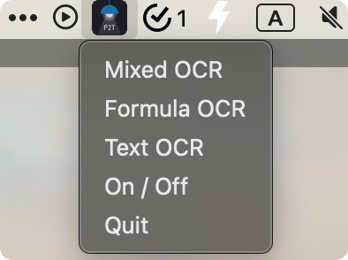
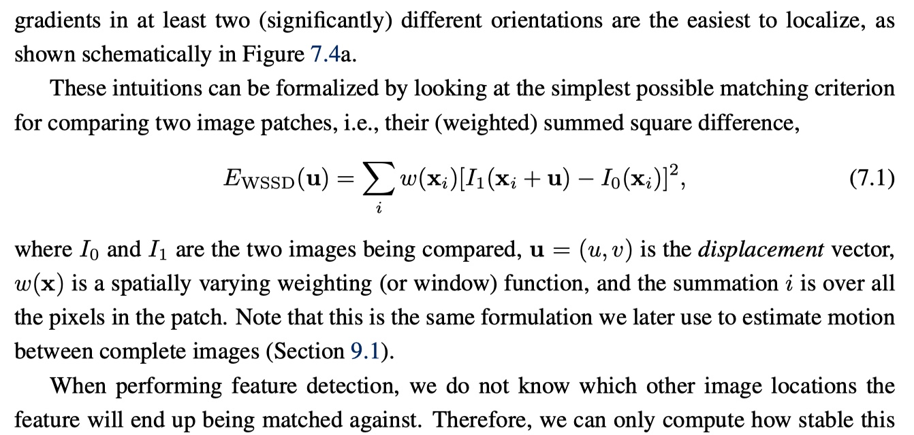
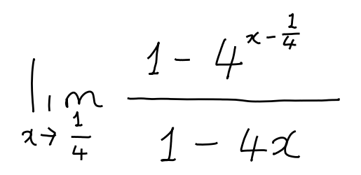

<div align="center">
  
  <div>&nbsp;</div>

[](https://discord.gg/GgD87WM8Tf)
[](https://visitorbadge.io/status?path=https%3A%2F%2Fgithub.com%2Fbreezedeus%2FPix2Text-Mac)
[](./LICENSE)
[](https://github.com/breezedeus/Pix2Text-Mac)

[](https://twitter.com/breezedeus)

[👩🏻‍💻 Pix2Text Online Service](https://p2t.breezedeus.com) |
[👨🏻‍💻 Pix2Text Online Demo](https://huggingface.co/spaces/breezedeus/Pix2Text-Demo) |
[💬 Contact](https://www.breezedeus.com/join-group)

</div>

<div align="center">

[中文](./README_cn.md) | English

</div>


# Pix2Text-Mac: A Mac desktop application for recognizing mathematical formulas

This project is a Mac local OCR application based on [**Pix2Text**](https://github.com/breezedeus/Pix2Text) (no internet connection required). It can recognize mathematical formula images from the clipboard and convert them to their LaTeX representation, which can then be copied to the clipboard. Additionally, it supports text recognition (Text OCR) from general images.

> Note ⚠️: This application is only available for MacOS.

The initial code of this project was forked from: [horennel/LaTex-OCR_for_macOS](https://github.com/horennel/LaTex-OCR_for_macOS). Special thanks to the author of this project.

## Features

After opening the application, you can see the Pix2Text application icon in the Mac menu bar, as shown below. It includes OCR for three different modes.

<div align="center">
  
</div>

### 1. `Mixed OCR`: Recognizing images with both formulas and text
This mode can recognize images containing both mathematical formulas and text. The recognition result is in Markdown format, which can be pasted into the [Pix2Text Online Service](https://p2t.breezedeus.com) to view the rendered result.

For example, it can recognize the following image ([assets/mixed-en.jpg](./assets/mixed-en.jpg)):

<div align="center">
  
</div>

### 2. `Formula OCR`: Recognizing images with pure formulas
This mode can recognize images containing only mathematical formulas. The recognition result is in LaTeX format, which can be pasted into the [Pix2Text Online Service](https://p2t.breezedeus.com) to view the rendered result.

For example, it can recognize the following image ([assets/math-formula-42.png](./assets/math-formula-42.png)):

<div align="center">
  
</div>

### 3. `Text OCR`: Recognizing images with pure text
This mode can recognize images containing only text. The recognition result is in plain text.

For example, it can recognize the following image ([assets/text.jpg](./assets/text.jpg)):

<div align="center">
  
</div>


### Installation

- Clone the repository:

```bash
git clone https://github.com/breezedeus/Pix2Text-Mac
```

- Install dependencies:

```bash
pip install -r requirements.txt
```

If you want to recognize text images in languages other than **Simplified Chinese and English**, please run the following command to install additional dependencies:

```bash
pip install pix2text[multilingual]
```

- Verify the installation is working correctly

Use the following command to verify if the installed [Pix2Text](https://github.com/breezedeus/Pix2Text) is working normally:

```bash
p2t predict -l en,ch_sim -a mfd -i assets/mixed-en.jpg
```

- Package the application:

```bash
python setup.py py2app -A
```

- You can find the application `Pix2Text.app` in the generated `dist` folder. Double-click to open it, or move it to the `Applications` folder.


### How to Use

- Launch the application
    - Start the `Pix2Text.app` application, and you will see the Pix2Text application icon in the menu bar.
    - Click the `On / Off` button in the menu bar icon to ensure that the `Mixed OCR`, `Formula OCR`, and `Mixed OCR` buttons are lit up.
- Take a screenshot
    - Use any screenshot software, such as `Snipaste`, to capture and copy to the clipboard.
- Recognition
    - Recognize images with both mathematical formulas and text
        - Click the `Mixed OCR` button.
        - After successful recognition, you will receive a notification in the notification center.
  - Recognize images with pure mathematical formulas
      - Click the `Formula OCR` button.
      - After successful recognition, you will receive a notification in the notification center.
  - Recognize images with pure text
    - Click the `Text OCR` button.
    - After successful recognition, you will receive a notification in the notification center.
  - If you do not want to receive notifications, you can turn them off in the system settings.
  - After receiving a notification, you can paste the result into the [Pix2Text Online Service](https://p2t.breezedeus.com) to view the rendered result.
  - You can modify the initialization configuration of Pix2Text by editing the configuration file [config.yaml](./config.yaml), such as which model to use and the path to the model. If you have purchased the [premium models](https://www.breezedeus.com/pix2text) (which provides better results), you can refer to the content of [pro-config.yaml](./pro-config.yaml) to modify [config.yaml](./config.yaml).

### Notes

- The first time you start the application, it will download models and configuration files, resulting in a long startup time. Subsequent startups will return to normal speed.
- The storage path for downloaded models and configuration files is `~/.cnstd`, `~/.cnocr`, and `~/.pix2text`.
- The application depends on the Python environment used during packaging. If the Python environment changes (e.g., the virtual environment used for packaging is deleted, the dependencies in the environment used for packaging are deleted or modified, or the Python environment on the computer is completely uninstalled), the application may not work properly and needs to be repackaged.

### Acknowledgments

- The initial code of this project was forked from: [horennel/LaTex-OCR_for_macOS](https://github.com/horennel/LaTex-OCR_for_macOS). Special thanks to the author of this project.
- [Pix2Text](https://github.com/breezedeus/Pix2Text)
- [pyperclip](https://github.com/asweigart/pyperclip)
- [rumps](https://github.com/jaredks/rumps)
- [py2app](https://github.com/ronaldoussoren/py2app)