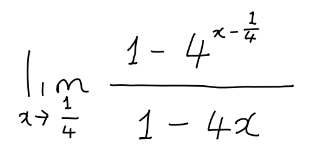
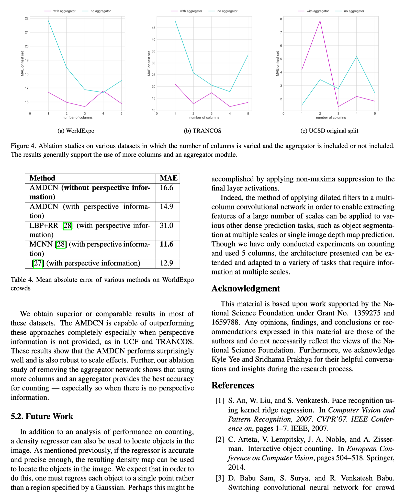

<div align="center">
  
  <div>&nbsp;</div>

[](https://discord.gg/GgD87WM8Tf)
[](https://visitorbadge.io/status?path=https%3A%2F%2Fgithub.com%2Fbreezedeus%2FPix2Text-Mac)
[](./LICENSE)
[](https://github.com/breezedeus/Pix2Text-Mac)

[](https://twitter.com/breezedeus)

[👩🏻‍💻 Pix2Text 网页版](https://p2t.breezedeus.com) |
[👨🏻‍💻 Pix2Text 在线 Demo](https://huggingface.co/spaces/breezedeus/Pix2Text-Demo) |
[📖 在线文档](https://pix2text.readthedocs.io) |
[💬 Contact](https://www.breezedeus.com/article/join-group)

</div>

<div align="center">

[English](README.md) | 中文

</div>


# Pix2Text-Mac: 识别数学公式的 Mac 桌面版应用
此项目是基于 [**Pix2Text**](https://github.com/breezedeus/Pix2Text) 实现的 Mac 本地 OCR 应用（无需联网），可以将剪贴板中的数学公式图片识别为其 LaTeX 表示，并将其复制到剪贴板；
同时也支持识别一般图片中的文本（文本 OCR）。

> 注意 ⚠️：该应用程序仅适用于 MacOS 。

本项目初始代码 Fork 自：[horennel/LaTex-OCR_for_macOS](https://github.com/horennel/LaTex-OCR_for_macOS)，感谢此项目作者。


## 功能

开启此应用后，可在 Mac 菜单栏看到 [Pix2Text](https://github.com/breezedeus/Pix2Text) 的应用图标，如下图。其中包含了 3 种模式的 OCR。

<div align="center">
  
</div>

### 1. `Text_Formula OCR`：识别既有公式又有文本的混合图片
可识别既包含数学公式又包含文本的混合图片，识别结果为 Markdown 格式，可把结果粘贴至 [Pix2Text 网页版](https://p2t.breezedeus.com) 查看渲染结果。

如可识别以下图片 ([assets/mixed.jpg](./assets/mixed.jpg))：

<div align="center">
  
</div>

### 2. `Formula OCR`：识别纯公式图片

可识别包含纯数学公式的图片，识别结果为 LaTeX 格式，可把结果粘贴至 [Pix2Text 网页版](https://p2t.breezedeus.com) 查看渲染结果。

如可识别以下图片 ([assets/math-formula-42.png](./assets/math-formula-42.png))：

<div align="center">
  
</div>

### 3. `Text OCR`：识别纯文本图片

可识别包含纯文本的图片，识别结果为纯文本。

如可识别以下图片 ([assets/text.jpg](./assets/text.jpg))：

<div align="center">
  
</div>

### 4. `Page OCR`：识别包含复杂排版的页面截图图片
如果一张图片中包含复杂的排版结构，如多列排版，或者其中包含表格等其他信息，可使用此模式进行识别。此模式会额外加载 `pix2text~=1.1` 中的**版面分析**以及**表格识别**模型识别图片中的所有信息，并把识别结果整合为 Markdown 格式，可把结果粘贴至 [Pix2Text 网页版](https://p2t.breezedeus.com) 查看渲染结果。

识别结果也会存储到本地指定文件夹；文件夹位置可以通过配置文件 [config.yaml](./config.yaml) 中的 `output_md_root_dir` 变量指定，默认为 `/tmp/output_mds` 文件夹。
同时，解析结果也会存储到本地指定文件夹；文件夹位置可以通过配置文件 [config.yaml](./config.yaml) 中的 `output_debug_dir` 变量指定，默认为 `/tmp/output_debugs` 文件夹。
可以自行手动更改这两个变量的取值以指定存储位置。

如可识别以下图片 ([assets/page.png](./assets/page.png))：

<div align="center">
  
</div>


## 如何安装

#### 1. 克隆库

```bash
git clone https://github.com/breezedeus/Pix2Text-Mac
```

或（国内）：

```bash
git clone https://gitee.com/breezedeus/Pix2Text-Mac
```

#### 2. 安装依赖环境

```bash
pip install -r requirements.txt
```

如果你想识别**简体中文、英文**以外其他语言的文字图片，请运行以下命令安装额外的依赖：

```bash
pip install pix2text[multilingual]>=1.1.0.1
```

#### 3. 验证安装是否一切正常

使用以下命令验证已安装的 [Pix2Text](https://github.com/breezedeus/Pix2Text) 是否可正常工作：

```bash
p2t predict -l en,ch_sim --resized-shape 768 --file-type page -i assets/page.png -o output-page --save-debug-res output-debug-page
```

#### 4. 打包应用程序

```bash
python setup.py py2app -A
```

- 在生成的 `dist` 文件夹中可以看到应用程序`Pix2Text.app`，双击打开，或者将其移动到`应用程序文件夹`即可。

## 如何使用

- 启动程序
    - 启动应用`Pix2Text.app`，可以在菜单栏看到 Pix2Text 应用程序的图标；
    - 点击菜单栏图标的 `On / Off` 按钮，确保 `Mixed OCR`、`Formula OCR` 和 `Mixed OCR` 按钮常亮。
- 截图
    - 使用任意截图软件，例如 `Snipaste`，截图并复制到剪切板。
- 识别
    - 识别数学公式和文字的混合图片
        - 点击 `Text_Formula OCR` 按钮
        - 识别成功后，会收到通知栏的通知
  - 识别纯数学公式图片
      - 点击 `Formula OCR` 按钮
      - 识别成功后，会收到通知栏的通知
  - 识别纯文本图片
    - 点击 `Text OCR` 按钮
    - 识别成功后，会收到通知栏的通知
  - 识别包含复杂排版的页面截图图片
    - 点击 `Page OCR` 按钮
    - 识别成功后，会收到通知栏的通知
  - 如果不想接受通知可以在系统设置里关闭通知。
  - 收到通知后，即可把结果粘贴至 [Pix2Text 网页版](https://p2t.breezedeus.com) 查看渲染结果。
  - 可通过配置文件 [config.yaml](./config.yaml) 修改 Pix2Text 初始化时的配置信息，如使用哪个模型以及模型所在的路径等。如果购买了[付费版模型](https://www.breezedeus.com/article/pix2text_cn)（效果更佳），可以参考 [pro-config.yaml](./pro-config.yaml) 内容对 [config.yaml](./config.yaml) 进行修改。

## 注意事项

- 第一次启动应用程序时会下载模型和配置文件，导致第一次启动时间过长，后续启动会恢复到正常速度；
- 模型和配置文件下载后的存储路径位于`～/.cnstd`和`~/.cnocr`和`~/.pix2text`；
- 应用程序依赖打包应用程序时的python环境，若python环境发成改变（例如：1.打包时使用的虚拟环境被删除 2.打包时使用的环境中的依赖库被删除修改
  3.电脑上的python环境被彻底卸载等情况），会导致应用程序无法正常使用，需重新打包。


## 感谢以下开源工具

- 本项目初始代码 Fork 自：[horennel/LaTex-OCR_for_macOS](https://github.com/horennel/LaTex-OCR_for_macOS)，感谢此项目作者
- [公式和文字识别：Pix2Text](https://github.com/breezedeus/Pix2Text)
- [复制和粘贴剪贴板：pyperclip](https://github.com/asweigart/pyperclip)
- [macOS菜单栏应用程序：rumps](https://github.com/jaredks/rumps)
- [macOS应用程序构建：py2app](https://github.com/ronaldoussoren/py2app)